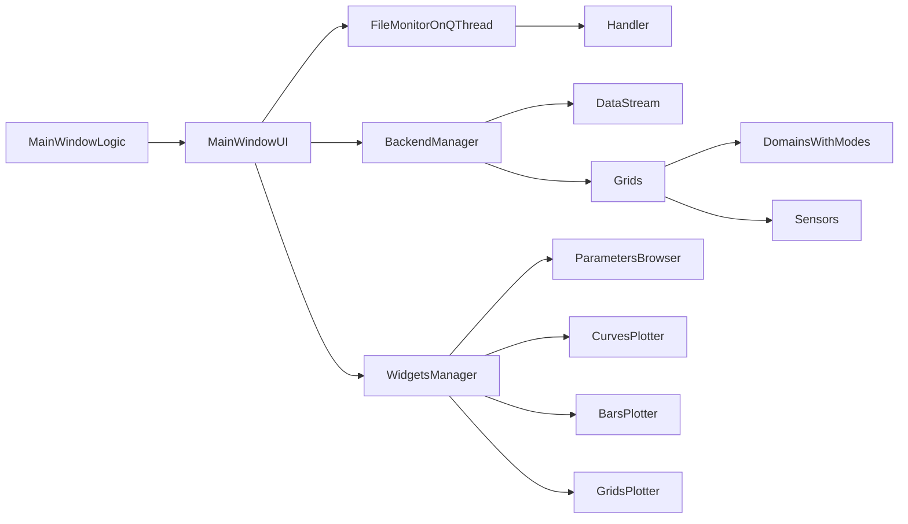
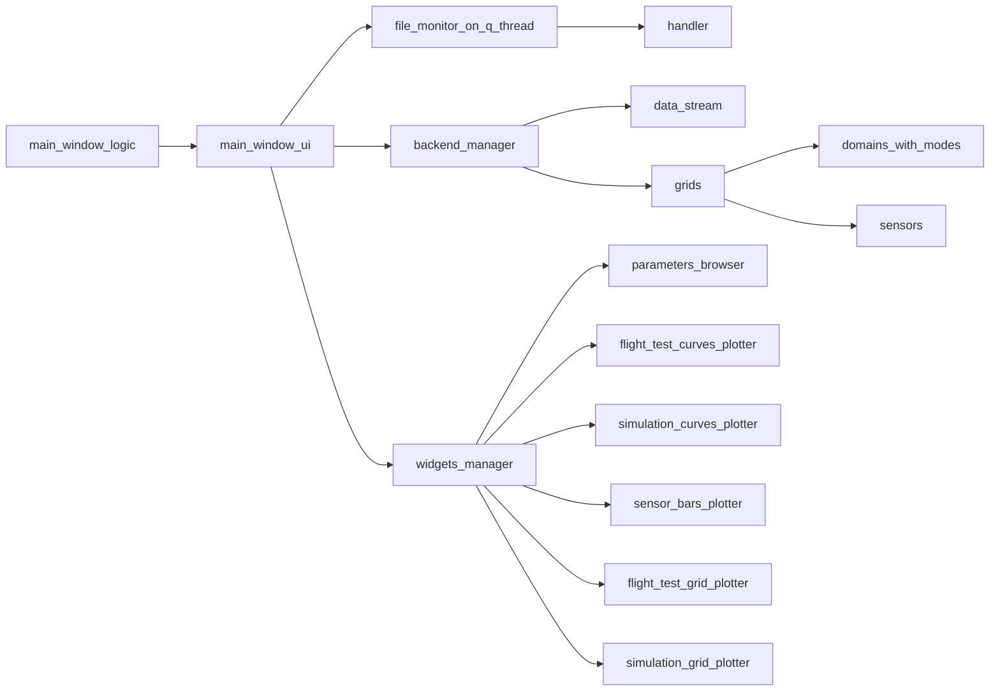
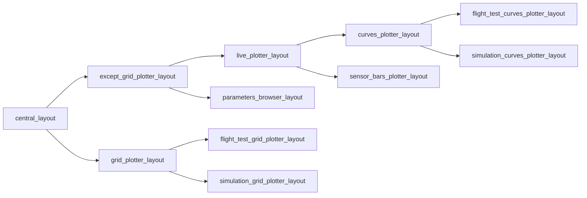

# Frame

## Code Frame

```mermaid
graph LR

MainWindowLogic-->MainWindowUI

MainWindowUI-->BackendManager
MainWindowUI-->WidgetsManager
MainWindowUI-->FileMonitorOnQThread

FileMonitorOnQThread-->Handler

BackendManager-->DataStream
BackendManager-->Grids
Grids-->DomainsWithModes
Grids-->Sensors

WidgetsManager-->ParametersBrowser
WidgetsManager-->CurvesPlotter
WidgetsManager-->BarsPlotter
WidgetsManager-->GridsPlotter
```

## Variables Frame

```mermaid
graph LR

main_window_logic-->main_window_ui
main_window_ui-->backend_manager
main_window_ui-->widgets_manager
main_window_ui-->file_monitor_on_q_thread

file_monitor_on_q_thread-->handler

backend_manager-->data_stream
backend_manager-->grids
grids-->domains_with_modes
grids-->sensors

widgets_manager-->parameters_browser
widgets_manager-->flight_test_curves_plotter
widgets_manager-->simulation_curves_plotter
widgets_manager-->sensor_bars_plotter
widgets_manager-->flight_test_grid_plotter
widgets_manager-->simulation_grid_plotter

```

## Layout Frame

```mermaid
graph LR

curves_plotter_layout-->flight_test_curves_plotter_layout
curves_plotter_layout-->simulation_curves_plotter_layout

live_plotter_layout-->sensor_bars_plotter_layout
live_plotter_layout-->curves_plotter_layout

except_grid_plotter_layout-->live_plotter_layout
except_grid_plotter_layout-->parameters_browser_layout

central_layout-->except_grid_plotter_layout
central_layout-->grid_plotter_layout

grid_plotter_layout-->flight_test_grid_plotter_layout
grid_plotter_layout-->simulation_grid_plotter_layout
```