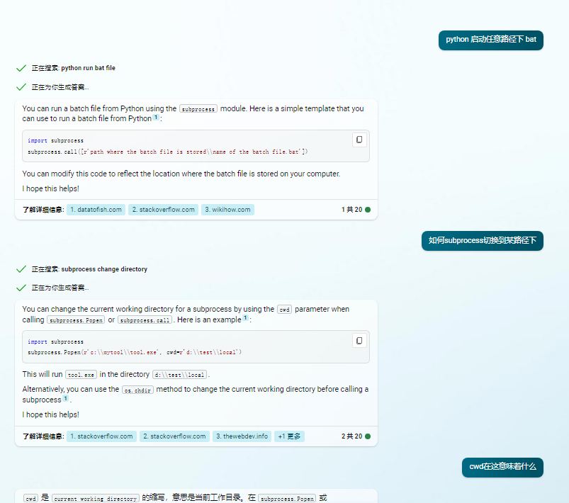

# How to run a bat in any directory

## here's the conversation with new bing




> python 启动任意路径下 bat

> You can run a batch file from Python using the subprocess module. Here is a simple template that you can use to run a batch file from Python:

```python
import subprocess
subprocess.call([r'path where the batch file is stored\\name of the batch file.bat'])
```

> You can modify this code to reflect the location where the batch file is stored on your computer. I hope this helps!

> 如何subprocess切换到某路径下

> You can change the current working directory for a subprocess by using the cwd parameter when calling subprocess.Popen or subprocess.call. Here is an example:

```python
import subprocess
subprocess.Popen(r'c:\\mytool\\tool.exe', cwd=r'd:\\test\\local')
```

> This will run tool.exe in the directory d:\\test\\local.Alternatively, you can use the os.chdir method to change the current working directory before calling a subprocess

> cwd在这意味着什么

> cwd 是 current working directory 的缩写，意思是当前工作目录。在 subprocess.Popen 或 subprocess.call 中使用 cwd 参数可以指定子进程运行时的工作目录。

> 如何用python获取一个文件所在的绝对路径

> 您可以使用 os.path 模块中的 abspath 函数来获取文件的绝对路径。例如：

```python
import os
file_path = 'example.txt'
abs_path = os.path.abspath(file_path)
print(abs_path)
```

> 复制这段代码将打印出 example.txt 文件的绝对路径。希望这对您有帮助！

> 我想去掉文件名，只保留其所在路径该如何做

> 您可以使用 os.path 模块中的 dirname 函数来获取文件所在的目录。例如：

```python
import os
file_path = '/path/to/example.txt'
dir_path = os.path.dirname(file_path)
print(dir_path)
```

> 复制这段代码将打印出 /path/to，即 example.txt 文件所在的目录。

## how to make this work

Now I have a file system looks like:

```txt
.
├── flight_test
│   ├── Calgrd_generic.dat
│   ├── ffsur.plt
│   ├── flight_test.dat
│   ├── generic.dat
│   ├── generic.inp
│   ├── mode_aero.plt
│   ├── mode_stru.plt
│   ├── patran-adm_rot.rpt
│   ├── patran-adm.rpt
│   ├── patran-fxd_rot.rpt
│   ├── patran-fxd.rpt
│   ├── swsur.plt
│   ├── sysur.plt
│   ├── test.dat
│   └── VT-z-ksp.exe
├── flight_test.bat
├── simulation
│   ├── m094kexc0fxd_8d85.dat
│   ├── simulation.dat
│   └── simulation_test.exe
├── simulation.bat
├── start.bat
└── start.py.py
```

And the file `flight_test/VT-z-ksp.exe` and `simultion/simulation.exe` is exactly what I want to run. They will update file `flight_test/flight_test.dat` and `simulation/simulation.dat`.

So I write 2 `.bat` files in root path here.

The first is: `./flight_test.bat`.

```bat
cd %~dp0
cd .//flight_test//
start VT-z-ksp.exe
```

And the second is: `./simulation.bat`.

```bat
cd %~dp0
cd simulation
start simulation_test.exe
```

These 2 `bat` files run the `xxx.bat`. Here I write a `bat` to run these 2 `bat` at the same time: `start.bat`.

```bat
cd %~dp0
del flight_test\\flight_test.dat
del simulation\\simulation.dat
start "" "flight_test.bat" 
start "" "simulation.bat"
```

Now I need to run the `bat` in python, so I write a `python` file in any directory on my PC:

```python
# start.py
import subprocess
import os
# print(os.path.dirname(r"C:\Users\bcynuaa\Desktop\LocalProject\GuoQT\TestData\ProjectFlightTest\start.bat"))
# subprocess.call([r"C:\Users\bcynuaa\Desktop\LocalProject\GuoQT\TestData\ProjectFlightTest\start.bat"], cwd=r"C:\Users\bcynuaa\Desktop\LocalProject\GuoQT\TestData\ProjectFlightTest")

def runBatFromAbsPath(bat_file_abspath: str) -> None:
    bat_file_absdir: str = os.path.dirname(bat_file_abspath)
    subprocess.call([bat_file_abspath], cwd=bat_file_absdir)
    pass

bat_file_abspath: str = r"C:\Users\bcynuaa\Desktop\LocalProject\GuoQT\TestData\ProjectFlightTest\start.bat"

runBatFromAbsPath(bat_file_abspath)
```

This is under the guidance of new bing which really works.